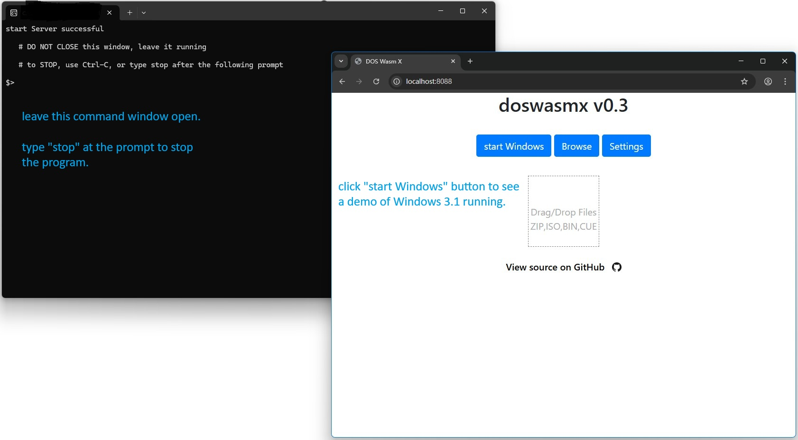
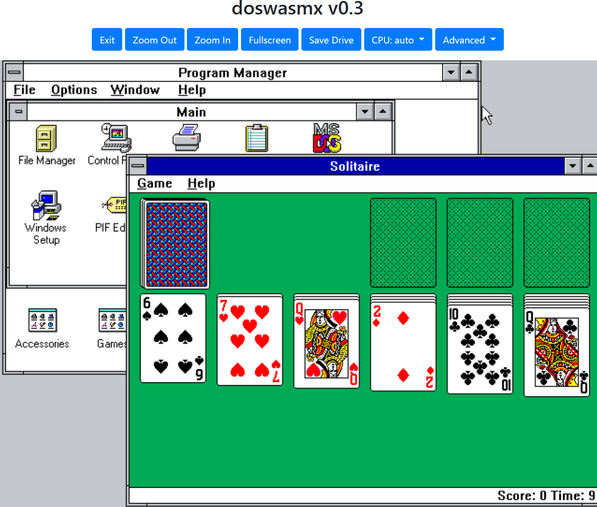
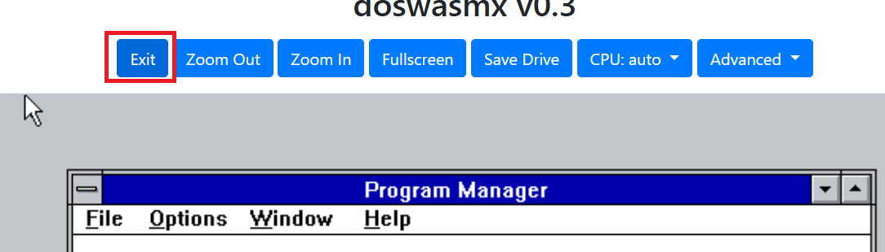
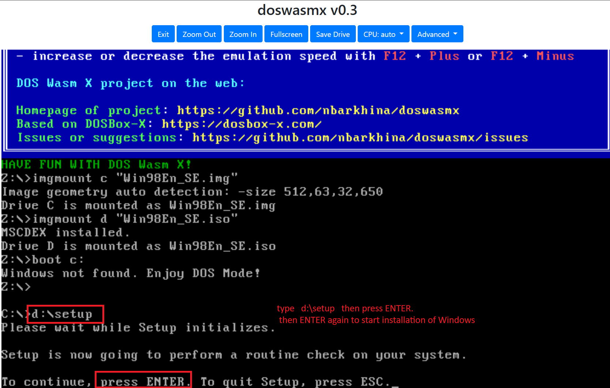
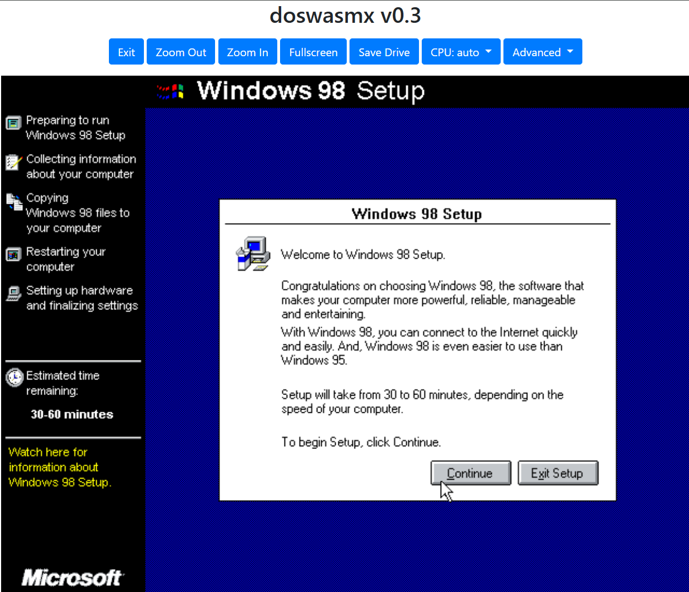
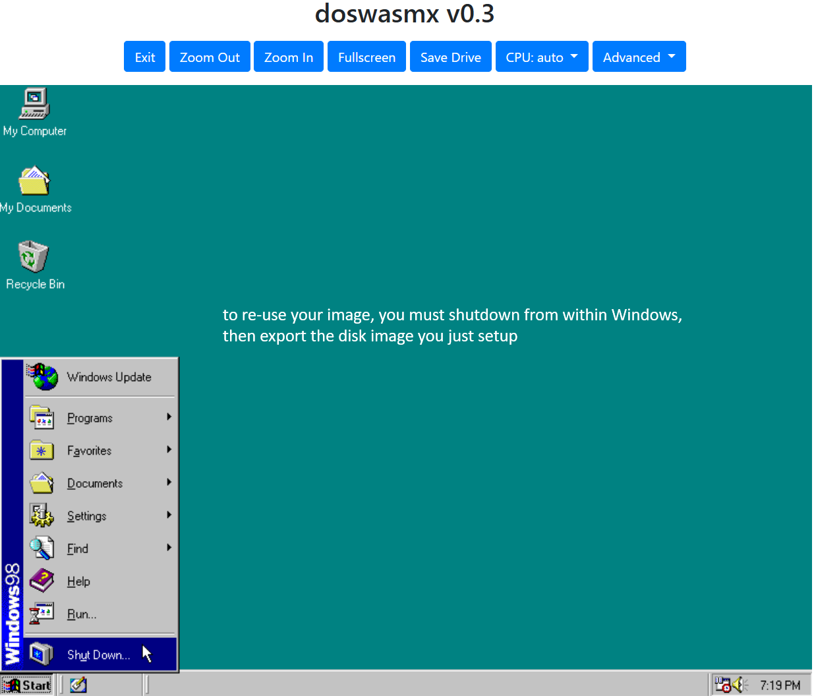
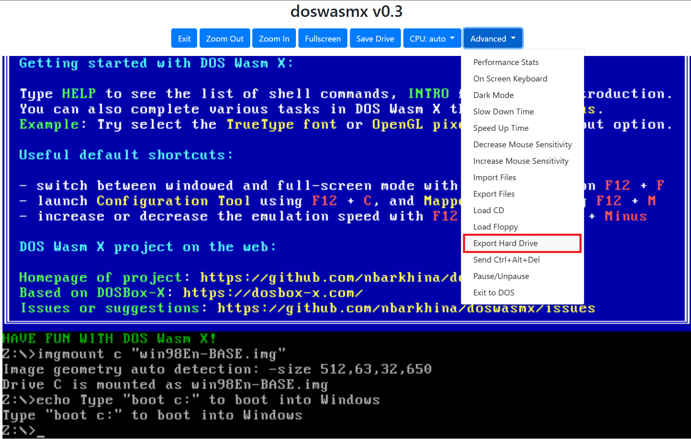

# Windows 98 gaming

- click to run version of [DosWasmX](https://github.com/nbarkhina/DosWasmX). NO virtual machines or emulators required
- supports Windows 98 / 95 games, and Windows 3.1 / DOS games
- runs on 64bit Windows and Linux

## comparing with other means to run Windows 9x games

| platform | GPU emulation | directx support | titles run well | titles can not run | note |
| --- | --- | --- | --- | --- | --- |
| doswasmx (this one) | S3 trio 64 | directx 6 | RedAlert (dx3), StarCraft1 (dx5), Age Of Empires (dx6) | Need For Speed 2, Delta Force | good for non-FPS gaming. no setup needed |
| |
| vmware / virtualbox | softGPU |directx 8 (up to directx 9) | Civilization3, Jane's IAF | Delta Force freezes | must install vmware, and a little complicated to setup softGPU |
| |
| 86box / PCem | various models, e.g.: voodoo 2000 | directx 6 / 7, depending on driver availability | Delta Force, Need for speed 2 in low graphics settings (640x480, 256 colors) | Civilization3, Jane's IAF | need drivers for chipsets, graphics, etc., which is sometimes hard to find |

---

## run the Windows 3.1 demo
1. download win31-demo-AMD64.exe from release
2. double click to run. you may need to grant the permission to run for the first time, if prompted by Windows 10 / 11 system.
3. a command prompt window will open, alongside a browser window. in the browser window, click the "Start Windows" button to begin
   
   

   
   
4. to stop the demo, shutdown windows, then click "exit" button on the browser page

   
   
5. now you can type "stop" at the command window prompt, and close the browser as well

---

## install and run Windows 98 (or Windows 95)
1. download win9x_blank-disk-AMD64.zip from release, extract the file to a folder you want
   - linux version is win9x_blank-disk-Linux-AMD64.zip
3. double click to run the extracted exe file. (for the Linux version, you need to unzip, and chmod a+x to run it)
   - DO NOT click on "start Windows", instead, drag your Windows 98 installation ISO file to the page center frame (as indicated on page)
   - you will see a command line. type "d:\setup"  then, press enter to begin installation
   
   
     
   - the system auto detects hardwares, installs drivers, and may reboot during the process
   
   
   
4. the above setup steps are done, you MUST save the completed Windows 98 image to your local disk to re-use it.
   - first, you should first shutdown windows, this ensures all data will be saved to browser cache
   
   
   
   - next, export the hard disk image
   
   
   
   - the image (hdd.img) should be downloaded to local \DOWNLOADS folder (chosen by your browser automatically)
   - you can try the image: exit the current session (click "Exit"), then drag the image file to start your own Windows

for more usage instructions, see [here](https://github.com/nbarkhina/DosWasmX) or the [online manual](https://nbarkhina.github.io/DosWasmX/) 
- you can always install a new OS, or use your own disk image
    - you can find a copy of OS at [WinWorld](https://winworldpc.com/product/windows-98/98-second-edition)
    - find more Windows 9x games on [WinWorld](https://winworldpc.com/library/games) and on [archive.org](https://archive.org/details/software)

---

## below intro copied directly from the original repo

# Screenshots

# Mobile Mode

# Overlay

- There is also a built in Overlay menu which can be accessed by pressing the tilde key on the keyboard "~"
- This can be useful for getting at certain functions when using a Gamepad Controller or to access the onscreen keyboard

# Installing Windows
DOS Wasm X supports installing Windows 95 or Windows 98 using your own copy of Windows. Simply drag and drop the ISO onto the startup page. DOS Wasm X will detect the Windows CD and begin the installation process. If you choose to Install Windows 95 you may get the error below. Simply click OK and then cancel when it asks you for the Path to the CD. This will allow you to continue with the installation. The reason for this error is because at this stage of the process the CD drivers have not yet been loaded. However after restarting Windows it will detect the CD Drive and finish installing the drivers successfuly. Always remember to shut down windows in the guest OS before exiting the page. This will automatically save your hard drive changes to the browser and prevent scandisk from running the next time you boot into Windows.

# References
The Following codebases were used in some part in creating this app

- DOSBox-X (Core Engine)
  - https://github.com/joncampbell123/dosbox-x 
- DOSBox Pure (Onscreen Keyboard)
  - https://github.com/schellingb/dosbox-pure
- JS Dos (JSDos Asyncify Module)
  - https://github.com/caiiiycuk/js-dos 
- Binaryen with Exceptions and Asyncify 
  - https://github.com/caiiiycuk/binaryen-fwasm-exceptions
- Emscripten 
  - https://github.com/emscripten-core/emscripten

# Disclaimer
This app was made for fun and is not affiliated or associated with Microsoft.
